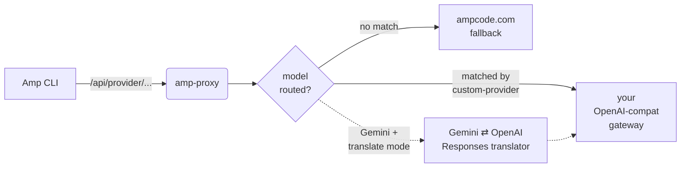

<div align="center">

# amp-proxy

**A focused reverse proxy for the [Sourcegraph Amp CLI](https://ampcode.com)**

Route specific models to third-party OpenAI-compatible endpoints, translate
Gemini requests into OpenAI Responses, and patch a handful of Amp-path bugs
along the way.

[](https://github.com/margbug01/amp-proxy/actions/workflows/ci.yml)
[](go.mod)
[](LICENSE)
[](https://github.com/router-for-me/CLIProxyAPI)

**English** · [简体中文](README.md)

</div>

---

## Why amp-proxy

Running Amp CLI against a self-hosted OpenAI-compatible gateway instead of
`ampcode.com` is a useful pattern — it gives you control over model choice
and billing. Upstream [CLIProxyAPI](https://github.com/router-for-me/CLIProxyAPI)
can do this in principle, but its Amp path has a few rough edges on
third-party providers:

- Non-streaming `/v1/messages` requests (used by Amp CLI's `librarian`
  subagent) silently return empty content from some upstreams, breaking
  tool calls.
- Google `v1beta1 generateContent` requests (used by the `finder`
  subagent) 404 on gateways that only speak OpenAI Responses or
  Anthropic Messages.
- A handful of Windows-hosting, logging, and stream-handling papercuts.

`amp-proxy` is the minimum subset of CLIProxyAPI needed to host the Amp
reverse proxy, plus a small `customproxy` package that routes models to
third-party endpoints and translates between protocols.

---

## How it works



1. Amp CLI sends a request; amp-proxy extracts the model name.
2. Optional `model-mappings` rewrite the model name in place.
3. If the rewritten model is claimed by a `custom-providers` entry, the
   request is forwarded to that gateway with a Bearer token. **Amp
   credits are not consumed.**
4. Anything not claimed falls through to `ampcode.com` (or `upstream-url`).
5. For Google Gemini v1beta paths, `gemini-route-mode: "translate"` runs
   the request through a protocol translator first, so even `finder` can
   ride on an OpenAI-only gateway.

---

## Features

| Feature | What it does |
|---|---|
| **Model-keyed routing** | Forward specific models to any OpenAI-compatible endpoint with one config entry. |
| **Anthropic stream upgrade** | Non-streaming `/v1/messages` is silently upgraded to SSE on the wire and collapsed back downstream, working around upstream content loss. |
| **Gemini ⇄ OpenAI translator** | Optionally rewrites `finder`'s `generateContent` calls into OpenAI Responses and translates the reply back into Gemini JSON. |
| **Model mappings** | Rewrite `model` fields pre-routing (e.g. `claude-opus-4-6` → `gpt-5.4(high)`). |
| **Hot reload** | Providers, mappings, and route modes reload without restart when `config.yaml` changes. |
| **Ampcode fallback** | Anything not claimed by a custom provider transparently proxies to the Amp control plane. |

---

## Quick start

### Prerequisites

- **Go 1.25+** (matches the toolchain declared in `go.mod`)
- A local API key Amp CLI will present
- Either an Amp upstream token, an OpenAI-compatible gateway, or both

### Build

```bash
git clone https://github.com/margbug01/amp-proxy.git
cd amp-proxy
go build -o amp-proxy ./cmd/amp-proxy
```

### Configure — the fast path: `init`

```bash
./amp-proxy init
```

Answer two questions (gateway URL, gateway Bearer token) and a ready-to-
run `config.yaml` is written for you — complete with a randomly
generated local API key, the full 9-entry Amp CLI model mapping table,
and sensible defaults. Skip straight to **Run** below.

If you'd rather hand-edit:

```bash
cp config.example.yaml config.yaml
$EDITOR config.yaml
```

`config.example.yaml` ships with the full Amp CLI model-routing table
pre-filled (9 mappings covering the claude / gpt / gemini families that
Amp CLI actually requests). To finish setup you typically only need to:

1. Replace the placeholder entry under `custom-providers` with your
   gateway's real `url` and `api-key`.
2. Pick a `gemini-route-mode` (`ampcode` or `translate`).
3. Set `upstream-api-key` if you want the ampcode.com fallback to work.

See the [Configuration](#configuration) section below for the full
walkthrough.

### Run

```bash
./amp-proxy --config config.yaml
```

Point Amp CLI at it:

```bash
export AMP_URL=http://127.0.0.1:8317
export AMP_API_KEY=<the api-key from your config.yaml>
amp
```

On Windows, use `scripts/restart.ps1` — it kills any stale
`amp-proxy.exe` and relaunches the server with stdout+stderr redirected
to `run.log`.

---

## Configuration

Everything lives in one YAML file. A minimal working configuration:

```yaml
host: "127.0.0.1"
port: 8317

api-keys:
  - "change-me"

ampcode:
  upstream-url: "https://ampcode.com"
  upstream-api-key: ""          # your Amp session token, or empty

  model-mappings:
    - from: "claude-opus-4-6"
      to: "gpt-5.4(high)"

  force-model-mappings: true

  custom-providers:
    - name: "my-gateway"
      url: "http://host:port/v1"
      api-key: "your-bearer-token"
      models:
        - "gpt-5.4"
        - "gpt-5.4-mini"
      responses-translate: true   # only for chat/completions-only gateways
      request-overrides:          # optional fixed upstream fields
        reasoning_effort: "high"

  gemini-route-mode: "translate"
```

### Routing decision order

| Step | Check | Action |
|---|---|---|
| 1 | Extract `model` from body or URL path | — |
| 2 | `force-model-mappings` + `model-mappings` match | Rewrite `model` in place |
| 3 | Rewritten model listed in any `custom-providers[*].models` | Forward to that gateway with Bearer auth |
| 4 | Google v1beta path + `gemini-route-mode: translate` | Run the Gemini translator before forwarding |
| 5 | Nothing claimed the request | Fall through to `upstream-url` (ampcode.com) |

### `gemini-route-mode`

Amp CLI's `finder` subagent issues Google `v1beta1 generateContent`
requests, which most OpenAI-compatible gateways don't speak.

| Value | Behaviour |
|---|---|
| `ampcode` (default) | Falls through to `ampcode.com`. Guaranteed protocol fidelity, consumes Amp credits. |
| `translate` | amp-proxy rewrites Gemini `generateContent` bodies into OpenAI Responses API calls, forwards them to the matched custom provider, and translates replies back into Gemini JSON before `finder` reads them. Saves credits; synthesised `call_id`s and a dropped `thoughtSignature` are the only semantic losses. `streamGenerateContent` translation is not supported yet and falls through to ampcode.com. |

### Authentication model

**amp-proxy only supports URL + Bearer token for custom providers.** There
is no OAuth login flow for ChatGPT / Claude Code / Gemini CLI — those were
deliberately excluded during the extraction from upstream CLIProxyAPI.

If you need OAuth, run a separate local gateway (CLIProxyAPI itself, or
any OpenAI-compat bridge) that terminates the OAuth flow and exposes a
plain bearer endpoint, then point a `custom-providers` entry at it. This
keeps amp-proxy small and protocol-focused.

---

## Development

### Tests

```bash
go build ./...
go vet  ./...
go test -count=1 ./internal/customproxy/...
```

The `customproxy` package ships an `httptest`-backed integration test
that exercises the full Gemini translate chain end-to-end (request
translation, fake augment SSE, response translation). A live smoke test
against a running amp-proxy instance is available as a Node.js script:

```bash
node scripts/test_gemini_translate.js
```

Set `AMP_PROXY_URL` / `AMP_PROXY_KEY` to target a non-default instance.

### Debug capture

Set `debug.capture-path-substring` in `config.yaml` to have amp-proxy
write raw request/response bodies for matching URL paths into
`./capture/*.log`. `debug.access-log-model-peek` lets the access log read
JSON request bodies for `model` / `stream` fields and is off by default.
These switches are for local development — bodies contain prompts and tool
calls, do not leave them on in production.

### Divergence tracking

[NOTICE.md](NOTICE.md) lists every file that diverges from the upstream
CLIProxyAPI baseline, with a short rationale for each change. Keep it
updated when you cherry-pick from upstream or fork-forward.

---

## Acknowledgments

amp-proxy is a derivative of
[CLIProxyAPI](https://github.com/router-for-me/CLIProxyAPI) by the
`router-for-me` team, used and extended under the MIT license. The
original codebase does most of the heavy lifting — amp-proxy only carves
out the Amp subsystem and adds the `customproxy` routing layer plus a
handful of fixes. See [NOTICE.md](NOTICE.md) for the full attribution.

## License

[MIT](LICENSE), inherited from upstream.
