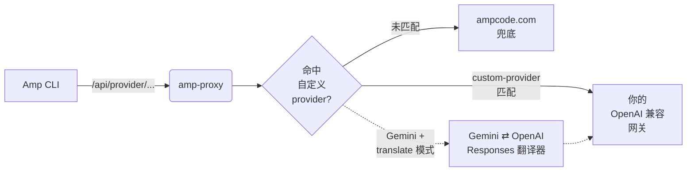

<div align="center">

# amp-proxy

**专注的 [Sourcegraph Amp CLI](https://ampcode.com) 反向代理**

把指定 model 路由到第三方 OpenAI 兼容端点、将 Gemini 请求翻译成 OpenAI Responses，
并顺手修复 Amp 路径上的几个 bug。

[](https://github.com/margbug01/amp-proxy/actions/workflows/ci.yml)
[](go.mod)
[](LICENSE)
[](https://github.com/router-for-me/CLIProxyAPI)

[English](README.md) · **简体中文**

</div>

---

## 为什么需要 amp-proxy

把 Amp CLI 指向你自己搭的 OpenAI 兼容网关（而不是 `ampcode.com`）是一种
很常见的用法 —— 你能自己决定用哪个 model、怎么计费。上游
[CLIProxyAPI](https://github.com/router-for-me/CLIProxyAPI) 理论上能做到，
但它的 Amp 路径在对接第三方 provider 时有几个粗糙的地方：

- 非流式 `/v1/messages` 请求（Amp CLI 的 `librarian` 子 agent 会用）在某些
  上游会悄悄返回空 content，导致工具调用失败。
- Google `v1beta1 generateContent` 请求（`finder` 子 agent 会用）在只讲
  OpenAI Responses 或 Anthropic Messages 的网关上直接 404。
- Windows 部署、日志、流式处理上还有几个小毛病。

`amp-proxy` 是从 CLIProxyAPI 里抽出来、刚好够跑 Amp 反向代理的最小子集，
再加上一个 `customproxy` 包负责按 model 路由到第三方端点并做协议翻译。

---

## 工作原理



1. Amp CLI 发请求，amp-proxy 先提取 model 名
2. 可选的 `model-mappings` 把 model 就地改写成别的名字
3. 如果改写后的 model 被某个 `custom-providers` 条目认领，请求转发到该
   网关并换上 Bearer token —— **不消耗 Amp credits**
4. 没被认领的请求兜底走 `ampcode.com`（或 `upstream-url`）
5. Google Gemini v1beta 路径在 `gemini-route-mode: "translate"` 下会先
   经过一层协议翻译，这样连 `finder` 都能跑在纯 OpenAI 网关上

---

## 特性

| 特性 | 作用 |
|---|---|
| **基于 model 的路由** | 用一行配置把特定 model 转发到任意 OpenAI 兼容端点 |
| **Anthropic 流式升级** | 把非流式 `/v1/messages` 在线路上悄悄升级成 SSE，再在下游折叠回单个 JSON，绕开上游丢 content 的 bug |
| **Gemini ⇄ OpenAI 翻译器** | 可选地把 `finder` 的 `generateContent` 请求翻译成 OpenAI Responses，再把响应翻译回 Gemini JSON |
| **Model 映射** | 路由前就地改写 `model` 字段（比如 `claude-opus-4-6` → `gpt-5.4(high)`） |
| **热重载** | `config.yaml` 改动后 provider、映射、路由模式无需重启即可生效 |
| **ampcode 兜底** | 没被自定义 provider 认领的流量透明转发到 Amp 控制平面 |

---

## 快速开始

### 前置要求

- **Go 1.25+**（和 `go.mod` 里声明的 toolchain 一致）
- 一个本地 API key，用于 Amp CLI 认证
- 要么有 Amp 上游 token，要么有 OpenAI 兼容网关，两者皆有也行

### 构建

```bash
git clone https://github.com/margbug01/amp-proxy.git
cd amp-proxy
go build -o amp-proxy .
```

### 配置

```bash
cp config.example.yaml config.yaml
$EDITOR config.yaml
```

`config.example.yaml` 已经预填了一整套 Amp CLI 的模型映射表（9 条，覆盖
Amp CLI 主 agent 和子 agent 会用到的 claude / gpt / gemini 系列）。你
通常只需要再做三件事：

1. 把 `custom-providers` 下的占位条目换成你自己网关的 `url` 和 `api-key`
2. 选一个 `gemini-route-mode`（`ampcode` 或 `translate`）
3. 如果希望 ampcode.com 兜底可用，填 `upstream-api-key`

完整配置说明见下面的 [配置](#配置) 小节。

### 运行

```bash
./amp-proxy --config config.yaml
```

把 Amp CLI 指向 amp-proxy：

```bash
export AMP_URL=http://127.0.0.1:8317
export AMP_API_KEY=<config.yaml 里的 api-key>
amp
```

Windows 用户用 `scripts/restart.ps1` —— 它会干掉残留的 `amp-proxy.exe`
并重启服务，把 stdout + stderr 都重定向到 `run.log`。

---

## 配置

一切都在一个 YAML 文件里。最小可用配置：

```yaml
host: "127.0.0.1"
port: 8317

api-keys:
  - "change-me"

ampcode:
  upstream-url: "https://ampcode.com"
  upstream-api-key: ""          # Amp session token，空也行

  model-mappings:
    - from: "claude-opus-4-6"
      to: "gpt-5.4(high)"

  force-model-mappings: true

  custom-providers:
    - name: "my-gateway"
      url: "http://host:port/v1"
      api-key: "your-bearer-token"
      models:
        - "gpt-5.4"
        - "gpt-5.4-mini"

  gemini-route-mode: "translate"
```

### 路由决策顺序

| 步骤 | 判断 | 动作 |
|---|---|---|
| 1 | 从 body 或 URL 路径中提取 `model` | — |
| 2 | `force-model-mappings` + `model-mappings` 命中 | 就地改写 `model` |
| 3 | 改写后的 model 出现在某 `custom-providers[*].models` | 用 Bearer 认证转发到对应网关 |
| 4 | Google v1beta 路径 + `gemini-route-mode: translate` | 先跑 Gemini 翻译器再转发 |
| 5 | 以上都不命中 | 兜底走 `upstream-url`（ampcode.com） |

### `gemini-route-mode`

Amp CLI 的 `finder` 子 agent 会发 Google `v1beta1 generateContent` 请求，
大多数 OpenAI 兼容网关不认识这种格式。

| 值 | 行为 |
|---|---|
| `ampcode`（默认） | 兜底走 `ampcode.com`，协议保真，消耗 Amp credits |
| `translate` | amp-proxy 把 Gemini 请求翻译成 OpenAI Responses 发到已匹配的 custom-provider，然后把响应翻译回 Gemini JSON 再交给 `finder`。节省 credits；代价是会合成 `call_id` 并丢弃 `thoughtSignature`，是唯二的语义损耗 |

### 认证模型

**custom-provider 只支持 URL + Bearer token**。没有 ChatGPT / Claude Code /
Gemini CLI 的 OAuth 登录流程 —— 这些在从上游 CLIProxyAPI 抽取时被有意砍掉了。

如果你需要 OAuth，在本地另跑一个网关（CLIProxyAPI 本身就可以，或任何
OpenAI 兼容的桥接器），让它处理 OAuth 流程并对外暴露一个普通的 bearer
endpoint，再把一个 `custom-providers` 条目指向它。这样 amp-proxy 能保持
小巧和协议专注。

---

## 开发

### 测试

```bash
go build ./...
go vet  ./...
go test -count=1 ./internal/customproxy/...
```

`customproxy` 包带了一个基于 `httptest` 的集成测试，会端到端跑完整的
Gemini 翻译链路（请求翻译 → 假 augment SSE → 响应翻译）。如果你需要对
一个真实跑着的 amp-proxy 实例做冒烟测试，可以直接跑这个 Node.js 脚本：

```bash
node scripts/test_gemini_translate.js
```

用 `AMP_PROXY_URL` / `AMP_PROXY_KEY` 环境变量指定非默认实例。

### Debug 抓包

在 `config.yaml` 里设 `debug.capture-path-substring`，amp-proxy 会把所有
匹配的 URL 请求和响应原文写到 `./capture/*.log`。仅用于本地开发 ——
里面有 prompts 和 tool calls，生产环境别开。

### Upstream 分歧追踪

[NOTICE.md](NOTICE.md) 列出了每个相对上游 CLIProxyAPI 有分歧的文件以及
原因。从上游 cherry-pick 或 fork-forward 时记得同步更新。

---

## 致谢

amp-proxy 是 [CLIProxyAPI](https://github.com/router-for-me/CLIProxyAPI)
（`router-for-me` 团队开发）的衍生作品，在 MIT 许可下使用和扩展。原始
代码库承担了绝大部分工作 —— amp-proxy 只是把 Amp 子系统拆出来，再加上
`customproxy` 路由层和几个修复。完整归属见 [NOTICE.md](NOTICE.md)。

## License

[MIT](LICENSE)，继承自上游。
